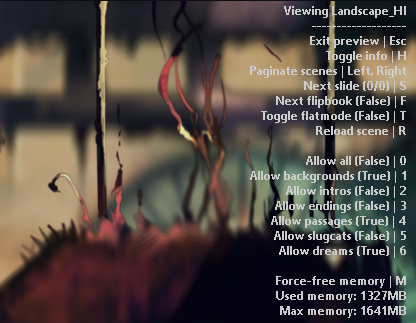

# Background preview
Lets you preview any in-game scene full screen, with parallax and no cluttery-ui\

Open from this mod's Remix menu, or from Options -> Backgrounds -> PREVIEW (only with Remix enabled).\
Also supports every kind of `MenuScene.SceneID`, as long as they are properly registered.\

## Controls
Mouse is disabled on the Preview menu, but moving it around still moves layers of the scene.\
Info on controls is also available in the menu\
- `H` toggles the info/help text
- `Esc` lets you quit the menu
- Left and right (joysticks supported) let you navigate to the next scene
- `R` lets you reload the current scene
- `M` forces unloading cached resources; This is done automatically before OOM, but if you find it sluggish you can do it yourself. 
- `T` toggles flatmode. In my experience this doesn't do much, and will be reset to False if it causes errors
- `S` goes to next slide, for scenes that have more than one slide (i.e. gourmand ending)
- `F` goes to next slide of Gourmand's dreams

## Configuration
You can configure, from the Preview menu and using your keyboard, the kind of Scenes you want to see.
- All (everything)
- Backgrounds (regions, and the game's main menu backgrounds)
- Intros (scenes that play when starting a character)
- Endings (scenes that play when finishing a character, or slugcat art available after that on the character select)
- Passages (shows passage scenes)
- Slugcats (from the character select screen)
- Dreams

The first scenne you will see will neverr be spoilery, but after that you can see everithing you want to\
Default settings have these scenes to true: All, Backgrounds and Intros.\
Your configuration is saved upon exiting the Preview menu.

## Quirks
If you feel laginness, press M to manually clear assets. If 32b, the game will crash when it uses >2600Mb, and way higher with 64b. By default, if the game takes 1GB more than it did in the beginning (capped at 2.4Gb), it clears itself.\
Sometimes the game may mess up loading scenes; that can be solved by pressing R, or M in the worst cases\
Not all categories are well-defined, because the game has an irregular scene-namesing scheme\
Some scenes are broken: Outro_3_Face, Intro_10_Fall, Intro_9_Rainy_Climb (you will get flashbanged with the two Intro ones, prepare your eyes)

## Visuals

<video src='./images/demo.webm'></video>
