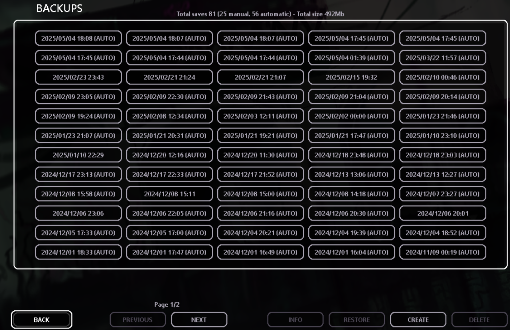
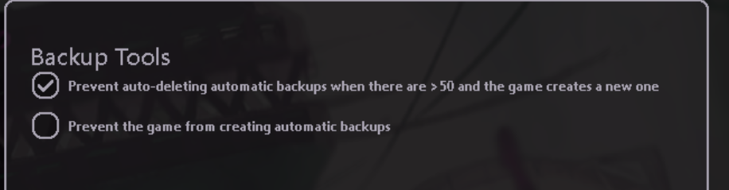

This mod does a few things related to game backups.

- Lets you have more than 50 automatic backups (by preventing their deletion) (disabled by default)
- Lets you disable the creation of new automatic backups (disabled by default)

It also adds QOL elements and functionality on the backups screen:
- Adds a backups quantity and overall size consumption label
- Adds a page number label
- Selecting a backup twice shows its Info box

  
  

This mod relies on an IL hook for preventing backups deletion. As such, if a game code update changes too much, this functionality will break. This mod will show a big warning box upon startup if the IL fails to hook (and another one when you open its remix menu)  

This mod replaces NoAutoBackup