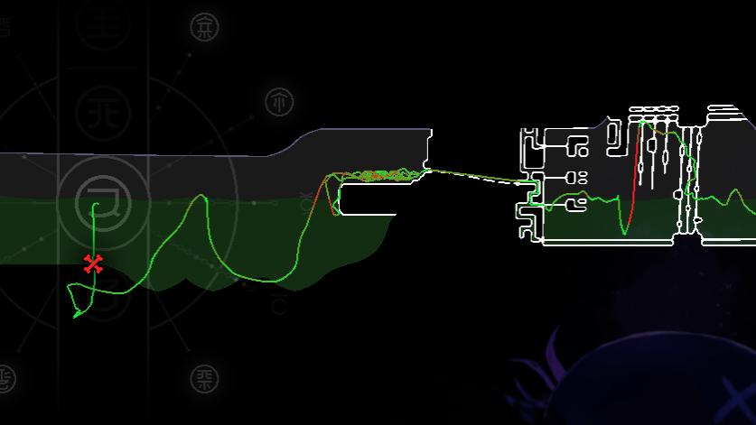
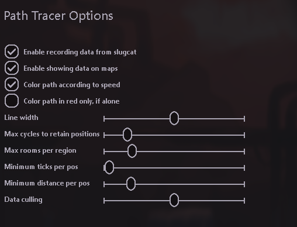
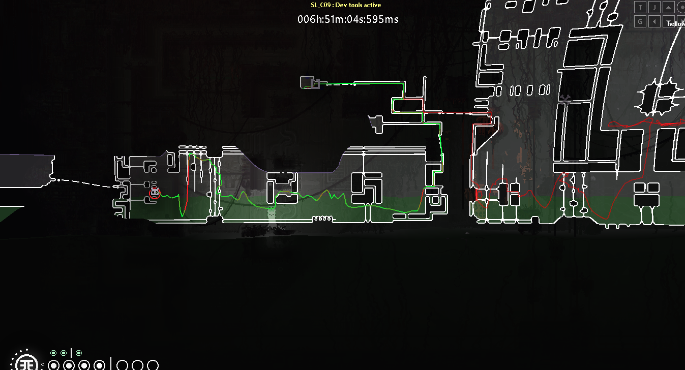

# Path Tracer
This mod is in beta !

Shows the path taken by slugcat on the map.
- Each slugcat has its own path in each region.
- Data is kept as long as the game is running, and will be automatically and intelligently cleared over time (see settings)
- Positions will be recorded when slugcat moves in campaign or expedition mode
- Data will be shown on map whenever a map is opened, including in the Regions menu
- Multiple slugcats can be shown on the in-game map (each have their own body-based color)
- Optionnaly, path color can reflect slugcat speed, or be set to red for visibility

You can configure a bunch of things in the settings (**defaults**) :
- Position collection can be **enabled** or disabled
- Showing data on map can be **enabled**/disabled
- Making color of the lines match player speed can be **enabled**/disabled
- Making color line red if only one player is playing can be enabled/**disabled**
- The width of lines drawn on map can be modified (**2.5f**)
- Maximum number of cycles to retain each positions for (**1**) (past cycles will become transparent)
- Maximum number of rooms to keep per region and per slugcat (**13**) (if more rooms have data in this region, the data will be deleted)
- Minimum game ticks to record a new position (**8**) (a position precision factor) (smaller is more precise)
- Minimum distance a new position has to have between the last one taken (**20**) (another position precision factor) (smaller is more precise)
- Precision of the data culling (**1500**) (points gathered in the same line are deleted to save up resources) (higher is less precise)

## Screenshots

