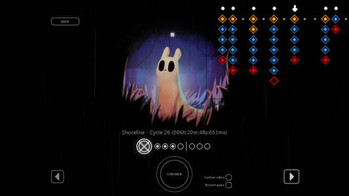
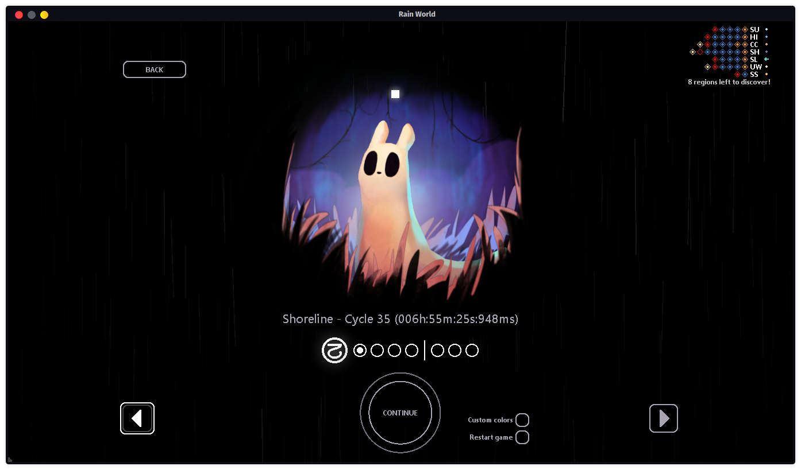
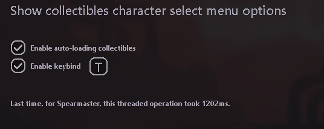

# Show Collectibles on Slugcat Select
This mod makes the tokens (or collectibles) tracker appear on character select menu. \
This is threaded and should not impact performance, and can be switched on and off in the remix menu, or using a keybind (also configurable in remix menu). \
This mod requires Rain World Remix to be enabled, and is compatible with Improved Collectibles Tracker ! Many thanks to Aissurtievos !\
The configurable status will be shown on the mod's Remix Menu description, along with the time it took to load collectibles last time the mod did so.

## Images

The size of the tracker is exaggerated for easy understanding purposes

Real size, with ImprovedCollectiblesTracker enabled

Remix menu
