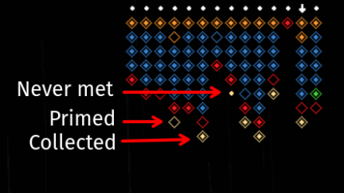
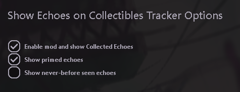

# Show me my echoes
This mod shows echo data inside the Collectibles Tracker.

From the remix menu, you can configure :
- If you want the mod to be enabled and show you Collected echoes
- If you want Primed echoes to show up
- If you want never-before seen echoes to show up

This mod is also available in the [Workshop](https://steamcommunity.com/sharedfiles/filedetails/?id=3432462352)
